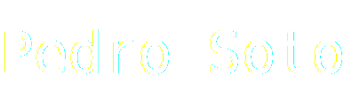
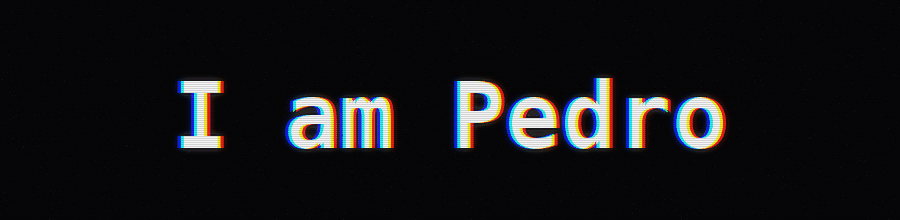

<!-- ========================= -->
<!-- 1) BANNER (CHOOSE ONE)    -->
<!-- ========================= -->

<!-- (A) Capsule Banner (quick) -->
<!-- 

  

 -->

<!-- 

  

 -->

  

<!-- ========================= -->
<!-- 2) CTA BUTTONS            -->
<!-- ========================= -->

&nbsp;&nbsp;&nbsp;&nbsp;
&nbsp;&nbsp;&nbsp;&nbsp;

<!-- ========================= -->
<!-- 3) ABOUT                  -->
<!-- ========================= -->

## About

- Software Engineer (Full-Stack)
- Building UIs with **Vue (2/3)** and **React**, and APIs with **Laravel / PHP**
- Experience with **React Native** (mobile)
- Working remotely with a team based in **Phoenix, AZ**

<!-- ========================= -->
<!-- 4) LANGUAGES & TOOLS      -->
<!-- ========================= -->

## Languages & Tools

  

<!-- ========================= -->
<!-- 5) PROJECTS               -->
<!-- ========================= -->

## Projects

- **prottoDom** — A micro frontend library inspired by ideas from **Vue** and early **React** patterns. Used as the UI foundation for **Fiction**.
- **Fiction** — Movie web SPA built with **Vanilla JavaScript + prottoDom**.  
  Live demo: https://pedrosotto717.github.io/fiction/dist/
- **pictunex_api** — Image service API built with **Vanilla PHP** + backoffice dashboard (upload/manage/share images).
- **pictunex_web** — A **Pexels-like** web client built with **Vanilla JavaScript**, consuming `pictunex_api`. 

  

